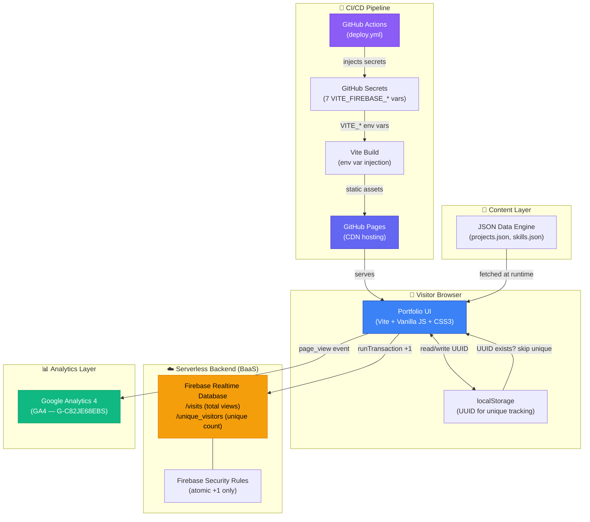
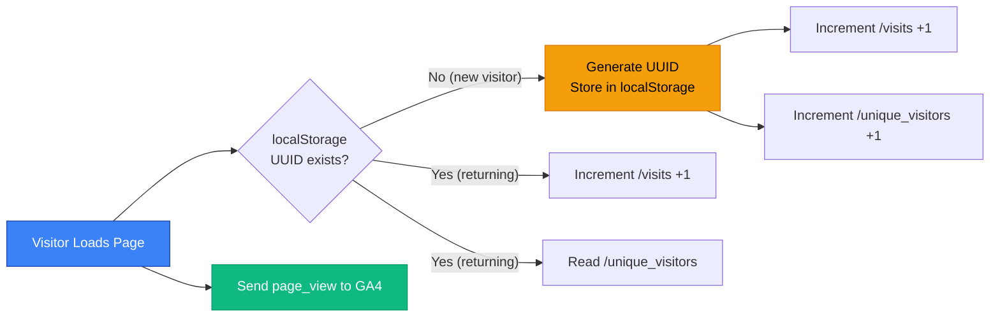

# Engineering Case Study: Portfolio Architecture & Automation

This document provides a deep dive into the technical architecture, SRE principles, and automation pipelines powering the Naveen Peram Professional Portfolio.

---

## 🏛️ System Architecture

## 🔧 Full-Stack Serverless Tech Stack

| Layer | Technology | Purpose |
|-------|-----------|---------|
| **Frontend** | Vite 8 + Vanilla JS (ES6+) + CSS3 | SPA-like rendering with custom design system, glassmorphism, CSS variables |
| **Backend (BaaS)** | Firebase Realtime Database | Real-time data persistence, atomic transactions, server-side security rules |
| **Analytics** | Google Analytics 4 | User demographics, traffic sources, device breakdown, session tracking |
| **Client Storage** | localStorage | Unique visitor identification via `crypto.randomUUID()` |
| **CI/CD** | GitHub Actions | Automated build pipeline with secret injection at compile time |
| **Hosting** | GitHub Pages (CDN) | Global static asset delivery |
| **Secrets Management** | GitHub Actions Secrets + `.env.local` | Zero-trust credential management — no secrets in source code |
| **Security** | Firebase Rules + GitHub Rulesets | Least-privilege DB access, branch protection, force-push blocking |

---

## 📐 Architectural Deep Dive

### **1. Data-Driven & Decoupled Design**
The core philosophy is the separation of **Content** from **Logic**. 
*   **Content Engine**: All professional data (Experience, Skills, Projects) is stored in normalized JSON files within `public/data/`.
*   **Dynamic Rendering**: Vanilla JavaScript (ES6+) parses these data sources at runtime, allowing the entire site to be updated without modifying a single line of HTML or CSS.
*   **Inline Fallback**: Critical project data is duplicated as inline JavaScript constants, ensuring the site renders correctly even if JSON fetches fail.
*   **Scalability**: This architecture allows for easy expansion into a multi-page site or a CMS-backed system in the future.

### **2. Automated CI/CD (GitHub Actions)**

*   **Workflow**: `Push to main` → `Install Dependencies` → `Inject Secrets` → `Vite Build` → `GitHub Pages Deploy`.
*   **Secret Injection**: Firebase credentials are stored as GitHub Actions Secrets and injected as `VITE_*` environment variables during the build step. Vite statically replaces `import.meta.env.VITE_*` references at compile time — no credentials exist in the source repository.
*   **Optimization**: The build step leverages Vite's advanced bundling to ensure minimal payload size and fast Time-to-Interactive (TTI).

### **3. Security & Governance (SRE Mindset)**
As a public repository, security was prioritized through "Policy-as-Code":
*   **GitHub Rulesets**: Active branch protection rules that block force-pushes and restrict deletions across all branches.
*   **Access Control**: Implemented an Admin-only bypass list to ensure that while the repo is public, only authorized changes can reach production.
*   **Privacy Hardening**: Removed all raw text documents and parser logs, ensuring only professional-grade assets are exposed.
*   **Secrets Management**: All sensitive configuration (Firebase API keys, project IDs) is managed through environment variables — `.env.local` for local dev (gitignored), GitHub Secrets for CI/CD. Zero credentials in source code.

### **4. UI Engineering**
*   **Modern CSS**: Built with a custom design system utilizing HSL color tokens, CSS Variables, and Glassmorphism.
*   **Mobile-First**: Fully responsive grid and flexbox layouts.
*   **Performance**: Localized SVG asset hosting to eliminate third-party request latency and ensure 100% icon reliability.
*   **Micro-Animations**: Section-switching transitions, scroll-reveal effects, role ticker, and counter animations for premium UX.

### **5. Analytics & Observability**

The portfolio implements a dual-layer analytics strategy for full visitor observability:

*   **Google Analytics 4 (GA4)**: Provides deep traffic analytics — user demographics, traffic sources, device breakdown, session duration, and real-time monitoring. The GA4 Measurement ID is a public identifier (not a secret) embedded directly in the HTML `<head>`.
*   **Firebase Realtime Database (Dual Counter)**: Powers two live, on-page counters displayed in the footer:
    *   **Total Views** (`/visits`): Incremented on every page load via atomic `runTransaction`.
    *   **Unique Visitors** (`/unique_visitors`): Incremented only on the first visit per browser. A UUID is generated via `crypto.randomUUID()` and stored in the visitor's `localStorage`. On subsequent visits, the UUID is detected and only the total views counter increments.
*   **Database Security Rules**: The Firebase Realtime Database is locked down with minimal-privilege rules:
    *   `/visits` — read: open, write: only allows `current_value + 1` (atomic increment)
    *   `/unique_visitors` — read: open, write: only allows `current_value + 1` (atomic increment)
    *   All other nodes — read/write: denied
    *   This prevents arbitrary data manipulation while allowing both counters to function.
*   **Graceful Degradation**: If Firebase credentials are missing (e.g., someone forks the repo without configuring secrets), both counters silently hide themselves — no errors, no broken UI.

---

## 💡 The "Vibe Coding" Workflow

The development of this platform utilized an advanced **Agentic AI** collaboration model:
*   **Spec-Driven Development**: High-fidelity technical specifications were developed through iterative "vibe" feedback loops.
*   **Agentic Orchestration**: Specifications were fed into a multi-agent system to handle execution, ensuring robust code quality and eliminating hallucinations.
*   **Velocity**: The entire transition from concept to a production-hardened site was achieved in **under 24 hours**.

---
*Back to [README.md](./README.md)*
